  
  

 

**Open source.** [ZensLoom](https://github.com/hassanarshad123/zensloom), a screen recorder written in Rust. [ICT LMS](https://github.com/hassanarshad123/ict_lms), a free learning platform. [DeerFlow](https://github.com/hassanarshad123/deerflow), a self-hosted AI agent setup.

**Talk to me.** [zensbot.com](https://zensbot.com) &nbsp;&nbsp; [LinkedIn](https://www.linkedin.com/in/hassanarshadd) &nbsp;&nbsp; [X](https://x.com/zensbot) &nbsp;&nbsp; [YouTube](https://www.youtube.com/@zensbot)
