  
  
  

  
  

 

**Open source.** [ZensLoom](https://github.com/hassanarshad123/zensloom), a screen recorder written in Rust. [ICT LMS](https://github.com/hassanarshad123/ict_lms), a free learning platform. [DeerFlow](https://github.com/hassanarshad123/deerflow), a self-hosted AI agent setup.

**Reach me.** [hassan@zensbot.com](mailto:hassan@zensbot.com) &nbsp;&nbsp; [LinkedIn](https://www.linkedin.com/in/hassanarshadd) &nbsp;&nbsp; [Instagram](https://www.instagram.com/zensbot) &nbsp;&nbsp; [zensbot.com](https://zensbot.com)
