  

  
  
  
  
  

 

I run **[Zensbot](https://zensbot.com)**, an AI company in Pakistan. We build our own products and ship AI systems for other businesses.
The rule we build by: **if it doesn't do real work for a real customer, it doesn't ship.**

 

## Products

  
  

  
  

| | What it is | Proof |
|---|---|---|
| **[ColdBot](https://coldbot.pro)** | An AI sales rep. It finds buyers, checks every email address, writes emails that read like a person wrote them, and books the call. | Runs our own outbound, and our clients'. |
| **[QanoonAI](https://qanoonai.pk)** | Pakistan's first AI legal intelligence platform. Ask a legal question, get the answer with the judgments behind it. | 16.3M judgments, 21 jurisdictions. PKR 14M investment. |
| **[ZensLearn](https://zenslearn.com)** | A white-label learning platform: web, mobile and desktop apps plus live classes, all under the institute's own brand. | 500+ institutes, 10,000+ users. |
| **Open source** | [ZensLoom](https://github.com/hassanarshad123/zensloom) (a Loom alternative in Rust), [ICT LMS](https://github.com/hassanarshad123/ict_lms), [DeerFlow](https://github.com/hassanarshad123/deerflow) (a self-hosted AI agent harness). | Free, forkable, yours. |

 

  

 

## What I build with

  

 

## Work with us

Need an AI system that pays for itself? **[Book a call at zensbot.com](https://zensbot.com)** or message me on **[LinkedIn](https://www.linkedin.com/in/hassanarshadd)**.

Built in Pakistan 🇵🇰 · shipped everywhere

